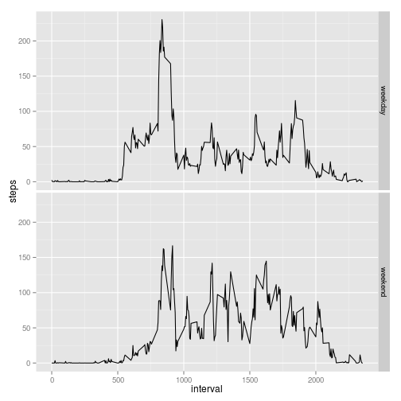

## Loading and preprocessing the data

```r
library(dplyr)
library(ggplot2)
library(knitr)
unzip(zipfile = "activity.zip")
act <- read.csv("activity.csv")
act$date <- as.Date(act$date)
```

## What is mean total number of steps taken per day?

```r
naAct <- act[complete.cases(act),] 
stepsByDay <- summarise(group_by(naAct,date), steps=sum(steps))
```
Another ways to calculate the same:  
* tapply(naAct\$steps, naAct$date, sum)  
* aggregate(steps ~ date, naAct, sum)  


```r
hist(stepsByDay$steps, breaks=15, main="Mean Steps by Day / missing values", 
     xlab="Steps")
```

 
   
The steps by day mean is 10766 and its median   10765


## What is the average daily activity pattern?

```r
naAct$dayInterval <- 1:(24*60/5)
stepsByInt <- summarise(group_by(naAct,dayInterval), steps=mean(steps))

p1 <- ggplot(stepsByInt, aes(x = dayInterval, y = steps))
p1 + geom_line()
```

 
    
This is the 5-minute interval that, on average across all the days in the dataset, contains the maximum number of steps, and that number of steps:   

```r
filter(stepsByInt, steps==max(steps))
```

```
## Source: local data frame [1 x 2]
## 
##   dayInterval    steps
## 1         104 206.1698
```

## Imputing missing values

There are 2304 rows with NA values.

To fill these missing values, we are going to use the mean interval . We assume that the number of
steps in one interval is similar to the number of steps of the same interval in other days. 


```r
act$dayInterval <- 1:(24*60/5)
actCo <- act
actCo <- merge(actCo,stepsByInt,by="dayInterval")

pos_na <- which(is.na(actCo$steps.x))
actCo[pos_na,"steps.x"] <-  actCo[pos_na,"steps.y"]

stepsByDay_Co <- summarise(group_by(actCo,date), steps=sum(steps.x))
hist(stepsByDay_Co$step, breaks=15, main="Mean Steps by Day / fill missing values", 
     xlab="Steps")
```

 
   
The steps by day mean is 10766 and its median   1.0766 &times; 10<sup>4</sup>.
There isn't difference with the distribution without filling the missing values. 
```

## Are there differences in activity patterns between weekdays and weekends?

```r
actCo$weekday <- weekdays(actCo$date)

pos_we <-actCo$weekday %in% c("Saturday", "Sunday")
pos_wd <- !(actCo$weekday %in% c("Saturday", "Sunday"))

actCo[pos_we,"weekday"] <- "weekend"
actCo[pos_wd,"weekday"] <- "weekday"
actCo$weekday <- factor(actCo$weekday)

stepsByInt_wd <- summarise(group_by(actCo,interval,weekday), steps=mean(steps.x))

qplot(interval, steps, data=stepsByInt_wd, geom="line") + facet_grid(weekday ~ .)
```

 


